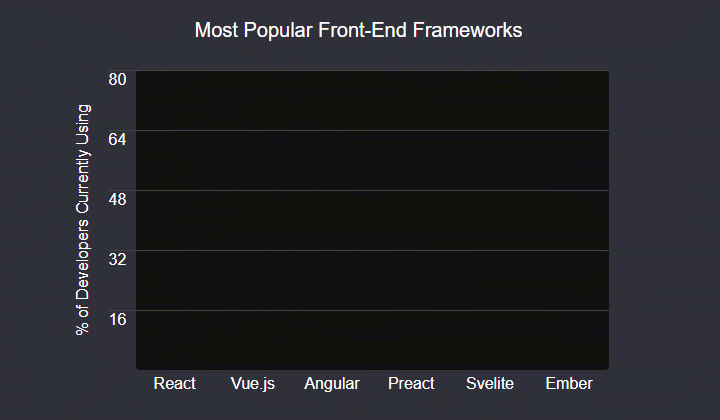
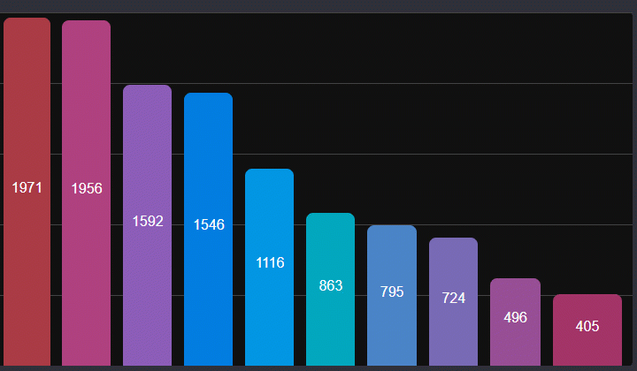

# Bar-Chart-Lib

<h2> About </h2>

Bar-Chart-Lib is a tool for rendering bar charts on web pages. It is simple to set up, and robust in its applications. Bar-Chart-Lib was created as part of a preparatory assignment for Lighthouse Labs' web development bootcamp.

<h2> Demo </h2>

A live demo of Bar-Chart-Lib can be found here: https://ahsolo.github.io/Bar-Chart-Lib/

<h2> Features </h2>

Bar-Chart-Lib contains the following features:
- Adjustable height and width.
- Automatic width adjustments when the webpage window is resized.
- The position of values can be chosen to be shown at the top, middle, or bottom of each bar.
- The colors of bars, text, and the background can be customized.
- Thickness of bars and the space between them can be adjusted.
- Custom labels can be written on each axis (X, Y).
- Fully customizable title, with choice of font, font size, and color.
- Multiple (stacked value bars): Show a collection of values stacked on top of each other in each bar.
- Built-in animations can be turned off.

<h2> How to use the API </h2>
