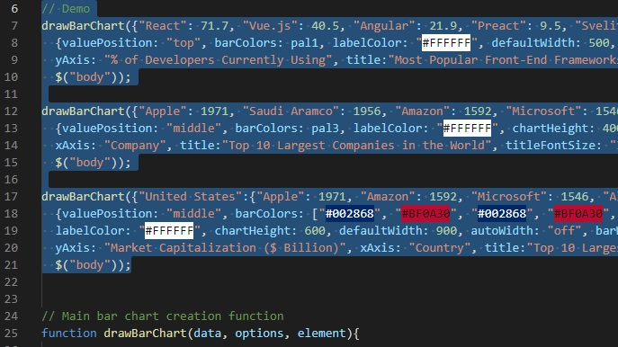

# Bar-Chart-Lib

<h2> About </h2>

Bar-Chart-Lib is a tool for rendering bar charts on web pages. It is simple to set up, and robust in its applications. Bar-Chart-Lib was created as part of a preparatory assignment for Lighthouse Labs' web development bootcamp.

<h2> Demo </h2>

A live demo of Bar-Chart-Lib can be found here: https://ahsolo.github.io/Bar-Chart-Lib/

<h2> Features </h2>

Bar-Chart-Lib contains the following features:
- Adjustable height and width.
- Automatic width adjustments when the webpage window is resized (option to disable).
- Choice where to show the position of values: the top, middle, or bottom of each bar.
- Customizable colors for bars, text, and the background.
- Bar thickness and the spaces between bars can be adjusted.
- Custom labels can be written on each axis (X, Y).
- Fully customizable title, with choice of font, font size, and color.
- Multiple (stacked value bars): Show a collection of values stacked on top of each other in each bar.
- Built-in animations (option to disable).

<h2> Installation </h2>

1.  Install or import the [jQuery library](https://jquery.com/) onto your webpage.

2.  Copy "barchartscript.js" and "barchartstyles.css" from this repository into a location accessible to your webpage.

3.  Link "barchartstyles.css" to your webpage by adding the following link to the `head` element of your HTML: `<link rel="stylesheet" href=[PATH]>`, replacing `[PATH]` with the path to the barchartystyles.css file.

4.  Link "barchartscript.js" to your webpage by adding the following script **below** where you loaded the jQUery library: ``, replacing `[PATH]` with the path to the barchartscript.js file. 

5.  "barchartscript.js" contains three demo charts. To remove them, navigate to the top of "barchartscript.js" and delete the three function calls of `drawBarChart()` underneath the `// Demo` comment. Alternatively, you may modify these values to see what is possible with this library.

<h2> How to use the API </h2>

Bar-Chart-Lib uses the following function signature: 
` drawBarChart(data, options, element) `

Each parameter is described in detail below.

<h3> The "data" parameter </h3>
`data` takes a javascript object in one of the following formats:

1.  To create a regular bar chart, `data` should be passed a javascript object where the property denotes the x-axis label of each respective bar, and the property value is a javascript number representing the value to be assigned to each respective bar: i.e. `{property1: property_value1, property2: property_value2, ... etc}`.

2.  To create a stacked bar chart, `data` should be passed a javascript object containing further javascript objects: i.e. `{x_axis_label1: {property1: property_value1,  property2: property_value2}, {x_axis_label2: {property3: property_value3,  property4: property_value4}... etc}` The property of the container object will be used for the x-axis label of each stacked bar. The property and property value of the inner objects will be displayed on the stacked bar chart in the following format "property : property_value". It is possible for a stacked bar to only contain only a single property: i.e. `{x_axis_label1: {property1: property_value1}, ... }`.

<h3> The "options" parameter </h3>

`options` consists of the customizable features included in Bar-Chart-Lib. Each is described below. `options` should be passed a javascript object where each property represents a specific option: `{Option1: value1, Option2: value2... etc}`. To use Bar-Chart-Lib without specifying any options, pass an empty object `{}` to this parameter instead.

**Chart Title Options:**
- chartTitle: The title of the chart (string).
- titleFont: The font family to be used for the chart title (string). Please be mindful that [web-safe fonts](https://www.w3schools.com/cssref/css_websafe_fonts.asp) should be used. It is possible to pass through a collection of fonts separated by commas (as a single string).
- titleFontSize: The font size of the chart title (string). Be sure to include "px" at the end of the string.
- titleColor: The font color of the chart title (string).

**Width and Height Options:**
- autoWidth: Unless this option is turned off (by passing `autoWidth:"off"` as an option), the bar will automatically resize its width when the webpage window is resized.
- defaultWidth: The default width of the chart in pixels (number). Note that setting a `defaultWidth` will not automatically disable `autoWidth`.
- barWidth: The thickness of bars, expessed as a percentage (string). Use this option to customize the spaces between bars.
- chartHeight: The height of the chart in pixels (number).

**Text Options:**
- yAxisLabel: The label to be applied to the y-axis of the chart as a whole (string).
- xAxisLabel: The label to be applied to the x-axis of the chart as a whole (string). Note that this label is separate from the labels that are applied to each bar. 

**Display Options**
- valuePosition: Where the value is displayed on each bar (string). Choices are "top", "middle", or "bottom". Note that values will automatically be displayed above a bar if the height of the bar is too short to display it within the bar.
- setBarColors: The color(s) that each bar will take. To color all bars the same color, pass a single color code (string). To color each bar individually, pass an array of color codes (array of strings): each color code within the array will be mapped to a single bar from left to right, bottom to top. Bar-Chart-Lib includes three pre-made palettes for your convenience. They can be referenced through there variable names: pal1, pal2, and pal3.
- setBackgroundColor: The color of the chart background (string).
- setLabelColor: The color of all text within the chart, with the exception of the title.
- animateBars: The default animations can be turned off by passing `animateBars:"off"` as an option.

<h3> The "element" parameter </h3>
This parameter takes a jQuery element designating where in the web page the bar chart should be rendered to. The bar chart will be appended to the end of the designated element.

<h2> Known Issues / Bugs </h2>

<h2> Roadmap </h2>
